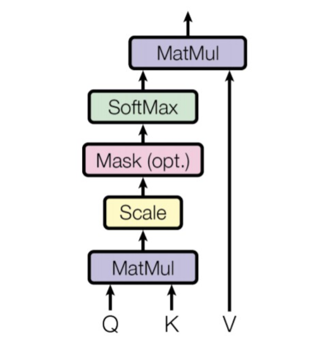

# Transformers

Use self, and cross attention to learn query, key, values(embedding) triplets for context generation

I use scaled dot product attention, although it can be easily changed to Additive attention

Transformers have the advantage of having no recurrent units, and thus requires less training time than previous recurrent neural architectures, "Wikipedia"

Uses multi head attention for internal context

